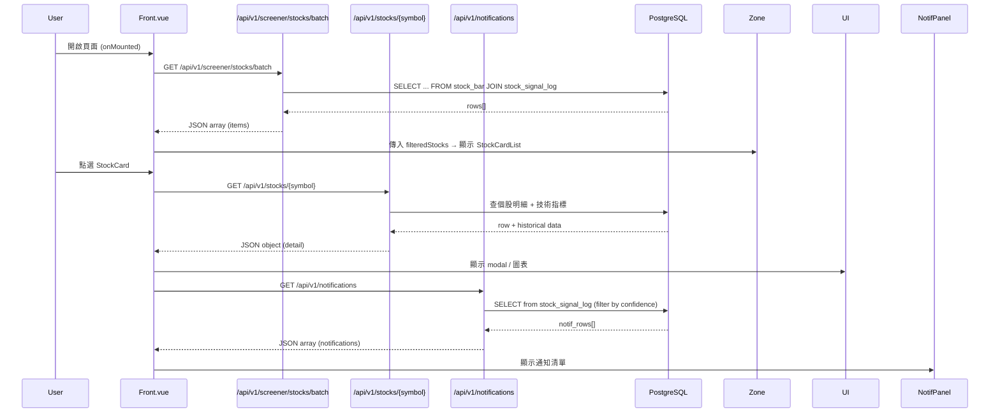
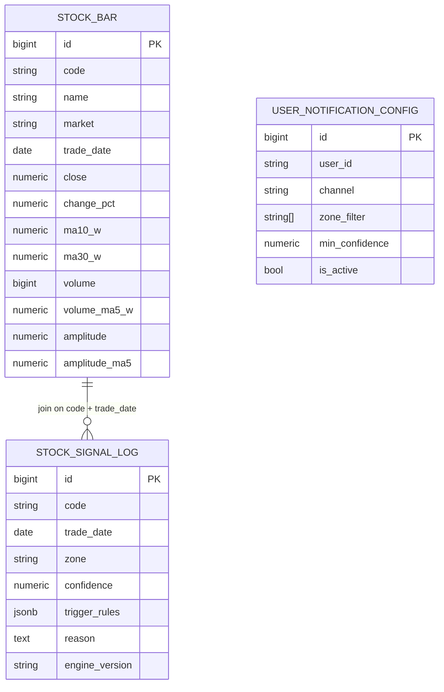

# Ambush System — API 資料流與欄位對應文件

> 本文件說明前端（Vue）到後端（FastAPI）再到資料庫（PostgreSQL）的完整資料傳遞流程、API 規格與欄位對應關係。

---

## 目錄

1. [整體架構流程圖](#1-整體架構流程圖)
2. [API 總覽](#2-api-總覽)
3. [API 詳細規格](#3-api-詳細規格)
   - [3.1 GET /api/v1/screener/stocks/batch](#31-get-apiv1screenerstocksbatch)
   - [3.2 GET /api/v1/stocks/{symbol}](#32-get-apiv1stockssymbol)
   - [3.3 GET /api/v1/notifications（建議新增）](#33-get-apiv1notifications建議新增)
4. [資料庫表格與欄位](#4-資料庫表格與欄位)
5. [前端元件資料傳遞鏈](#5-前端元件資料傳遞鏈)
6. [典型 SQL 查詢範例](#6-典型-sql-查詢範例)
7. [前端欄位映射邏輯](#7-前端欄位映射邏輯)

---

## 1. 整體架構流程圖

### 1.1 系統流程圖（Flowchart）

```mermaid
flowchart LR
  subgraph Frontend
    UI[Front.vue]
    Zone[ZonePanel / StockCardList / StockCard]
    Stat[StatCard]
    NotifPanel[通知面板]
    UI --> Zone
    UI --> Stat
    UI --> NotifPanel
  end

  UI -->|GET /api/v1/screener/stocks/batch| Screener[/api/v1/screener/stocks/batch]
  UI -->|GET /api/v1/stocks/:symbol| StockAPI[/api/v1/stocks/{symbol}]
  UI -->|GET /api/v1/notifications| NotifAPI[/api/v1/notifications]

  subgraph Backend [FastAPI Routers]
    Screener --> SvcScreener[screener.batch_get_stocks]
    StockAPI --> SvcStock[stock_detail.get_stock_detail]
    NotifAPI --> SvcNotif[notifications (suggested)]
  end

  SvcScreener -->|JOIN code + trade_date| DB_SB[(stock_bar)]
  SvcScreener -->|JOIN code + trade_date| DB_SSL[(stock_signal_log)]
  SvcStock --> DB_SB
  SvcStock --> DB_SSL
  SvcNotif --> DB_SSL
  SvcNotif --> DB_SB

  DB_SB --- DB_SSL
  SvcScreener -->|JSON array| UI
  SvcStock -->|JSON object| UI
  SvcNotif -->|JSON array| UI
```

### 1.2 序列圖（Sequence Diagram）



### 1.3 資料庫 ER 圖



---

## 2. API 總覽

| 前端函式 | HTTP 方法 | API 端點 | 用途 | 狀態 |
|----------|-----------|----------|------|------|
| `fetchStocks()` | GET | `/api/v1/screener/stocks/batch` | 取得股票清單（含 zone、技術指標） | ✅ 已實作 |
| `fetchStats()` | GET | `/api/v1/screener/stocks/batch` | 取得統計資料（與上方同一端點，前端自行計算） | ✅ 已實作 |
| `testApiConnection()` | GET | `/api/v1/stocks/2330.TW` | 測試 API 連線（單一個股） | ✅ 已實作 |
| `openStockDetail()` | GET | `/api/v1/stocks/{symbol}` | 取得個股詳細資料（router 導頁用） | ✅ 已實作 |
| `fetchNotifications()` | GET | `/api/v1/notifications` | 取得通知清單 | ⏳ 建議新增 |

---

## 3. API 詳細規格

### 3.1 GET /api/v1/screener/stocks/batch

**後端 Router**: `backend/app/routers/screener.py` → `batch_get_stocks()`

#### 請求參數（Query Parameters）

| 參數 | 型態 | 必填 | 說明 | 範例 |
|------|------|------|------|------|
| `symbols` | string | 否 | 以逗號分隔的股票代碼 | `2330.TW,2317.TW` |
| `zone` | string | 否 | 篩選 zone | `UPTREND` |
| `market` | string | 否 | 市場別 | `TW` |
| `page` | int | 否 | 頁碼（預設 1） | `1` |
| `page_size` | int | 否 | 每頁筆數（預設 50） | `50` |

#### 回應格式（JSON Array）

```json
[
  {
    "symbol": "2330.TW",
    "name": "台積電",
    "market": "TW",
    "price": 580.0,
    "changePct": 2.5,
    "zone": "UPTREND",
    "ma10": 575.3,
    "ma30": 560.8,
    "score": 0.92,
    "volChange": 1.5,
    "eps": "3.2%",
    "mktCap": "1.2兆",
    "insider": "0.5%",
    "topic": "AI",
    "lastUpdate": "2026-05-19T08:00:00Z",
    "signals": ["放量突破", "均線多頭"],
    "rules": ["rule1_trend", "rule5_fundamental"],
    "suggestion": "買進"
  }
]
```

#### 欄位對應（後端 Model → API Response → 前端）

| 後端欄位（DB） | API 回傳欄位 | 前端使用位置 | 說明 |
|----------------|-------------|-------------|------|
| `StockBar.code` | `symbol` | `StockCard.symbol` | 股票代碼 |
| `StockBar.name` | `name` | `StockCard.name` | 股票名稱 |
| `StockBar.market` | `market` | - | 市場別 |
| `StockBar.close` | `price` | `StockCard.price` | 收盤價 |
| `StockBar.change_pct` | `changePct` | `StockCard.changePct` | 漲跌幅（%） |
| `StockBar.ma10_w` | `ma10` | `StockCard.ma10` | 10週均線 |
| `StockBar.ma30_w` | `ma30` | `StockCard.ma30` | 30週均線 |
| `StockSignalLog.zone` | `zone` | 經 zoneMap 轉換為 `up/down/pot` | 趨勢分區 |
| `StockSignalLog.confidence` | `score` | `StockCard.score` | 信心分數 |

---

### 3.2 GET /api/v1/stocks/{symbol}

**後端 Router**: `backend/app/routers/stock_detail.py` → `get_stock_detail()`

#### 路徑參數

| 參數 | 型態 | 說明 | 範例 |
|------|------|------|------|
| `symbol` | string | 股票代碼（含市場後綴） | `2330.TW` |

#### 回應格式（JSON Object）

```json
{
  "symbol": "2330.TW",
  "name": "台積電",
  "price": 580.0,
  "change_pct": 2.5,
  "volume": 12500000,
  "market_cap": 1200000000000,
  "pe_ratio": 18.5,
  "technical_indicators": {
    "ma10": 575.3,
    "ma30": 560.8,
    "ma10_ma30_ratio": 1.026
  },
  "zone_info": {
    "zone": "UPTREND",
    "confidence": 0.92,
    "explanation": "價格站穩10週線與30週線之上，多頭排列"
  },
  "rules": [
    {
      "layer": 1,
      "rule_name": "rule1_trend",
      "passed": true,
      "description": "趨勢規則",
      "details": "MA10 > MA30，價格 > MA10"
    }
  ],
  "updated_at": "2026-05-19T08:00:00Z"
}
```

#### 欄位對應

| API 回傳欄位 | 前端使用位置 | 說明 |
|-------------|-------------|------|
| `symbol` | 路由參數、標題 | 股票代碼 |
| `name` | 標題 | 股票名稱 |
| `price` | 價格顯示、圖表 | 當前價格 |
| `change_pct` | 漲跌幅標示 | 漲跌百分比 |
| `volume` | 成交量顯示 | 成交量 |
| `market_cap` | `selectedStock.mktCap` | 市值 |
| `pe_ratio` | 本益比顯示 | 本益比 |
| `technical_indicators.ma10` | 圖表、指標 | 10週均線 |
| `technical_indicators.ma30` | 圖表、指標 | 30週均線 |
| `zone_info.zone` | zone 標籤 | 趨勢分區 |
| `zone_info.confidence` | 信心顯示 | 信心分數 |
| `zone_info.explanation` | 說明文字 | 趨勢解釋 |
| `rules[].passed` | 規則檢核清單 | 規則是否通過 |
| `rules[].description` | 規則說明 | 規則描述 |

---

### 3.3 GET /api/v1/notifications（建議新增）

**建議後端 Router**: `backend/app/routers/notifications.py`

#### 請求參數（Query Parameters）

| 參數 | 型態 | 必填 | 預設值 | 說明 |
|------|------|------|--------|------|
| `limit` | int | 否 | 50 | 回傳筆數上限 |
| `min_conf` | float | 否 | 0.7 | 最低信心門檻 |

#### 回應格式（JSON Array）

```json
[
  {
    "id": 1234,
    "type": "sell",
    "time": "16:05",
    "title": "2330.TW 台積電 觸發 DOWNTREND",
    "desc": "信心 0.85，規則: 放量滯漲",
    "symbol": "2330.TW",
    "price": 580.0,
    "confidence": 0.85
  }
]
```

#### 欄位對應

| API 回傳欄位 | 前端使用位置 | 說明 |
|-------------|-------------|------|
| `id` | 通知唯一識別 | 流水號 |
| `type` | 通知類型圖示 | `buy` / `sell` / `info`（由 zone 推導） |
| `time` | 通知時間顯示 | 格式 `HH:mm` |
| `title` | 通知標題 | 組合 `${symbol} ${name} ${zone}` |
| `desc` | 通知描述 | 觸發規則說明 |
| `symbol` | 點擊後導頁 | 股票代碼 |
| `price` | 價格顯示 | 當前價格 |
| `confidence` | 信心顯示 | 信心分數 |

#### 後端實作範例（Python / FastAPI）

```python
from fastapi import APIRouter, Depends
from sqlalchemy.orm import Session
from sqlalchemy import func
from app.database import get_db
from app.models.stock_signal_log import StockSignalLog
from app.models.stock_bar import StockBar

router = APIRouter(prefix="/api/v1/notifications", tags=["notifications"])

@router.get("/")
async def get_notifications(limit: int = 50, min_conf: float = 0.7, db: Session = Depends(get_db)):
    latest = db.query(func.max(StockSignalLog.trade_date)).scalar()
    if not latest:
        return []

    q = (
        db.query(StockSignalLog, StockBar)
        .outerjoin(
            StockBar,
            (StockBar.code == StockSignalLog.code) &
            (StockBar.trade_date == StockSignalLog.trade_date)
        )
        .filter(StockSignalLog.trade_date == latest)
        .filter(StockSignalLog.confidence >= min_conf)
        .order_by(StockSignalLog.confidence.desc())
        .limit(limit)
    )

    items = []
    for s, b in q.all():
        zone_upper = s.zone.upper() if s.zone else ""
        if zone_upper == "UPTREND":
            typ = "buy"
        elif zone_upper == "DOWNTREND":
            typ = "sell"
        else:
            typ = "info"

        items.append({
            "id": s.id,
            "type": typ,
            "time": s.trade_date.strftime("%H:%M") if hasattr(s.trade_date, "strftime") else str(s.trade_date),
            "title": f"{s.code} {b.name if b else ''} {s.zone}",
            "desc": (s.reason or "")[:200],
            "symbol": s.code,
            "price": float(b.close) if b and b.close else None,
            "confidence": float(s.confidence) if s.confidence else None
        })

    return items
```

---

## 4. 資料庫表格與欄位

### 4.1 `stock_bar`（週線行情 / 技術指標）

| 欄位 | 型態 | 說明 | 對應 API 欄位 |
|------|------|------|-------------|
| `id` | BIGINT PK | 流水號 | - |
| `code` | VARCHAR | 股票代碼（含市場後綴） | `symbol` |
| `name` | VARCHAR | 股票名稱 | `name` |
| `market` | VARCHAR | 市場別（TW/US） | `market` |
| `trade_date` | DATE | 交易日 | `lastUpdate` |
| `open` | NUMERIC | 開盤價 | - |
| `high` | NUMERIC | 最高價 | - |
| `low` | NUMERIC | 最低價 | - |
| `close` | NUMERIC | 收盤價 | `price` |
| `change_pct` | NUMERIC | 漲跌幅（%） | `changePct` |
| `volume` | BIGINT | 成交量 | `volume` |
| `volume_ma5_w` | NUMERIC | 5週均量 | - |
| `ma10_w` | NUMERIC | 10週均線 | `ma10` |
| `ma30_w` | NUMERIC | 30週均線 | `ma30` |
| `amplitude` | NUMERIC | 振幅 | - |
| `amplitude_ma5` | NUMERIC | 5週平均振幅 | - |

### 4.2 `stock_signal_log`（信號紀錄）

| 欄位 | 型態 | 說明 | 對應 API 欄位 |
|------|------|------|-------------|
| `id` | BIGINT PK | 流水號 | `id`（notifications） |
| `code` | VARCHAR | 股票代碼 | `symbol` |
| `trade_date` | DATE | 交易日 | `time` / `lastUpdate` |
| `zone` | VARCHAR | 趨勢分區（UPTREND/POTENTIAL/DOWNTREND） | `zone` |
| `confidence` | NUMERIC | 信心分數（0~1） | `score` / `confidence` |
| `trigger_rules` | JSONB | 觸發的規則清單 | `rules` |
| `reason` | TEXT | 判斷理由 | `desc`（notifications） |
| `engine_version` | VARCHAR | 引擎版本 | - |

### 4.3 `user_notification_config`（使用者通知偏好）

| 欄位 | 型態 | 說明 |
|------|------|------|
| `id` | BIGINT PK | 流水號 |
| `user_id` | VARCHAR | 使用者 ID |
| `channel` | VARCHAR | 通知管道（email/push/...） |
| `zone_filter` | VARCHAR[] | 篩選的 zone 類型 |
| `min_confidence` | NUMERIC | 最低信心門檻 |
| `is_active` | BOOLEAN | 是否啟用 |

---

## 5. 前端元件資料傳遞鏈

### 5.1 股票清單資料流

```
Front.vue (onMounted)
  │
  ├─ fetchStocks() → GET /api/v1/screener/stocks/batch
  │                    ↓
  │                  stocks.value = response[]
  │                    ↓
  │                  filteredStocks (computed, 依目前 tab 篩選)
  │                    ↓
  │                  <ZonePanel :stocks="filteredStocks">
  │                    ↓
  │                  <StockCardList :stocks="stocks">
  │                    ↓
  │                  <StockCard v-for="stock in stocks" :stock="stock">
  │                    ├─ 顯示 symbol, name, price, changePct, ma10, score
  │                    └─ @click → router.push(`/stocks/${stock.symbol}`)
  │
  ├─ fetchStats() → GET /api/v1/screener/stocks/batch (同一端點)
  │                    ↓
  │                  stats.value = 前端計算統計
  │                    ↓
  │                  <StatCard :value="stats.upZone.value" color="green" />
  │                  <StatCard :value="stats.downZone.value" color="red" />
  │                  <StatCard :value="stats.potZone.value" color="yellow" />
  │                  <StatCard :value="stats.winRate.value" color="blue" />
  │
  └─ fetchNotifications() → GET /api/v1/notifications
                             ↓
                           notifications.value = response[]
                             ↓
                           通知面板（右上 bell 圖示）
```

### 5.2 個股詳細資料流

```
StockCard @click
  │
  └─ router.push(`/stocks/${stock.symbol}`)
       │
       └─ StockDetail.vue (或其他 route)
            │
            └─ onMounted → GET /api/v1/stocks/{symbol}
                            ↓
                          detail = response
                            ↓
                          ├─ 顯示基本資訊（price, change_pct, volume...）
                          ├─ 技術指標（ma10, ma30, ma10_ma30_ratio）
                          ├─ zone 資訊（zone, confidence, explanation）
                          ├─ 規則檢核清單（rules[].passed, description）
                          └─ 圖表（initChart 使用 price, ma10, ma30）
```

### 5.3 前端 Props 傳遞結構

```
Front.vue
  ├── <StatCard :value="stats.upZone.value" :label="stats.upZone.label" color="green" />
  ├── <StatCard :value="stats.downZone.value" :label="stats.downZone.label" color="red" />
  ├── <StatCard :value="stats.potZone.value" :label="stats.potZone.label" color="yellow" />
  ├── <StatCard :value="stats.winRate.value" :label="stats.winRate.label" color="blue" />
  │
  └── <ZonePanel :stocks="filteredStocks" :title="currentTabLabel">
        │
        └── <StockCardList :stocks="stocks">
              │
              └── <StockCard v-for="stock in stocks" :stock="stock" :key="stock.symbol" />
```

---

## 6. 典型 SQL 查詢範例

### 6.1 批次取得最新股票清單（對應 `/api/v1/screener/stocks/batch`）

```sql
SELECT
  b.code          AS symbol,
  b.name,
  b.market,
  b.close::double precision         AS price,
  b.change_pct::double precision    AS changePct,
  b.ma10_w::double precision        AS ma10,
  b.ma30_w::double precision        AS ma30,
  s.zone,
  s.confidence::double precision    AS score
FROM stock_bar b
JOIN stock_signal_log s
  ON b.code = s.code
  AND b.trade_date = s.trade_date
WHERE s.trade_date = (SELECT MAX(trade_date) FROM stock_signal_log)
  -- 可選篩選條件：
  -- AND b.code IN ('2330.TW', '2317.TW')
  -- AND s.zone = 'UPTREND'
  -- AND b.market = 'TW'
ORDER BY s.confidence DESC;
```

### 6.2 取得個股詳細資料（對應 `/api/v1/stocks/{symbol}`）

```sql
SELECT
  b.code, b.name, b.close, b.change_pct,
  b.volume, b.ma10_w, b.ma30_w,
  s.zone, s.confidence, s.reason, s.trigger_rules
FROM stock_bar b
JOIN stock_signal_log s
  ON b.code = s.code
  AND b.trade_date = s.trade_date
WHERE b.code = '2330.TW'
  AND s.trade_date = (SELECT MAX(trade_date) FROM stock_signal_log);
```

### 6.3 取得通知清單（對應建議的 `/api/v1/notifications`）

```sql
SELECT
  s.id,
  s.code          AS symbol,
  b.name,
  s.trade_date,
  s.zone,
  s.confidence::double precision    AS confidence,
  s.trigger_rules,
  s.reason,
  b.close::double precision         AS price
FROM stock_signal_log s
LEFT JOIN stock_bar b
  ON s.code = b.code
  AND s.trade_date = b.trade_date
WHERE s.trade_date = (SELECT MAX(trade_date) FROM stock_signal_log)
  AND s.confidence >= 0.7
ORDER BY s.confidence DESC
LIMIT 50;
```

---

## 7. 前端欄位映射邏輯

### 7.1 Zone 映射（`fetchStocks()` 使用）

```javascript
// Front.vue 中的 zoneMap
const zoneMap = {
  'UPTREND':    'up',
  'POTENTIAL':  'pot',
  'DOWNTREND':  'down'
}

// 使用方式
const displayZone = zoneMap[stock.zone] || 'pot'
```

### 7.2 Zone 映射（`fetchStats()` 使用 — 支援小寫商業用詞）

```javascript
// Front.vue 中的 fetchStats zoneMap
const zoneMap = {
  buy:  'up',
  hold: 'pot',
  sell: 'down'
}

// 使用方式（先轉小寫再比對）
const key = zoneMap[stock.zone?.toLowerCase()] || 'pot'
```

### 7.3 通知類型推導（後端實作邏輯）

```python
# 由 zone 推導通知類型
zone_upper = s.zone.upper() if s.zone else ""
if zone_upper == "UPTREND":
    typ = "buy"
elif zone_upper == "DOWNTREND":
    typ = "sell"
else:
    typ = "info"
```

### 7.4 前端統計計算邏輯（`fetchStats()`）

```javascript
// 前端根據 batch API 回傳的 stocks 計算統計
const stats = {
  upZone:   { value: stocks.filter(s => zoneMap[s.zone?.toLowerCase()] === 'up').length,   label: '多方' },
  downZone: { value: stocks.filter(s => zoneMap[s.zone?.toLowerCase()] === 'down').length, label: '空方' },
  potZone:  { value: stocks.filter(s => zoneMap[s.zone?.toLowerCase()] === 'pot').length,  label: '潛力' },
  winRate:  { value: /* 計算勝率 */, label: '勝率' }
}
```

---

## 附錄：檔案路徑參考

| 元件 / 檔案 | 路徑 |
|------------|------|
| Front.vue（主頁面） | `frontend/src/views/Front.vue` |
| StatCard.vue（統計卡片） | `frontend/src/components/StatCard.vue` |
| ZonePanel.vue（分區面板） | `frontend/src/components/ZonePanel.vue` |
| StockCardList.vue（股票列表） | `frontend/src/components/StockCardList.vue` |
| StockCard.vue（股票卡片） | `frontend/src/components/StockCard.vue` |
| Screener Router（批次 API） | `backend/app/routers/screener.py` |
| Stock Detail Router（個股 API） | `backend/app/routers/stock_detail.py` |
| Stock Bar Model（資料表） | `backend/app/models/stock_bar.py` |
| Stock Signal Log Model（資料表） | `backend/app/models/stock_signal_log.py` |
| User Notification Config Model（資料表） | `backend/app/models/user_notification_config.py` |

---

> **文件版本**: v1.0  
> **最後更新**: 2026-06-01  
> **維護者**: Ambush System Team
